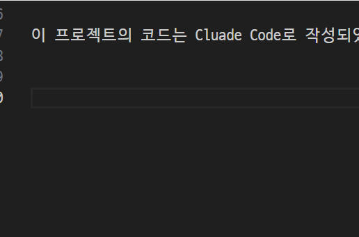

# IME Indicator

마우스 커서를 따라다니며 현재 입력 모드(**한글 / 영문**)를 표시해 주는 Windows용 유틸리티입니다.

한/영 전환 상태를 확인하려고 작업 표시줄을 보거나, 글자를 잘못 입력한 뒤 지우는 번거로움을 줄여 줍니다.

| 모드 | 표시 |
|------|------|
| 한글 | 파란 배경에 `한` |
| 영문 | 회색 배경에 `e` |



## 특징

- 마우스 커서 옆에 작은 인디케이터가 따라다닙니다.
- 클릭이 통과되는 투명 창이라 작업을 방해하지 않습니다.
- 작업 표시줄과 Alt+Tab 목록에 나타나지 않습니다.
- 외부 라이브러리 없이 Python 표준 라이브러리(`tkinter`, `ctypes`)만 사용합니다.

## 요구 사항

- Windows 10 / 11
- Python 3.8 이상 (tkinter 포함)

## 실행 방법

```bash
pythonw ime_indicator.pyw
```

`.pyw` 확장자이므로 탐색기에서 더블클릭해도 콘솔 창 없이 실행됩니다.

### Windows 시작 시 자동 실행

1. `Win + R` → `shell:startup` 입력
2. 열린 폴더에 `ime_indicator.pyw`의 바로 가기를 추가합니다.

### 종료

콘솔 창이 없으므로 작업 관리자에서 `pythonw.exe` 프로세스를 종료합니다.

## 설정

파일 상단의 설정 값을 수정하여 원하는 대로 조정할 수 있습니다.

| 항목 | 기본값 | 설명 |
|------|--------|------|
| `POLL_MS` | `10` | 상태 확인 주기(ms) |
| `OFFSET_X` / `OFFSET_Y` | `16` / `20` | 커서로부터의 표시 위치 |
| `ALPHA` | `215` | 투명도 (0~255) |
| `FONT_FAMILY` / `FONT_SIZE` | `맑은 고딕` / `11` | 글꼴 |
| `COLOR_KO_BG` / `COLOR_EN_BG` | `#1a6fe8` / `#606060` | 모드별 배경색 |

## 동작 원리

IME 상태를 다음 순서로 확인하며, 앞 단계가 실패하면 다음 방법으로 넘어갑니다.

1. `ImmGetDefaultIMEWnd` + `WM_IME_CONTROL`(`IMC_GETCONVERSIONMODE`)로 IME 창에 변환 모드를 직접 조회
2. `ImmGetContext` → `ImmGetConversionStatus` (IMM 기반 앱 보조)
3. `GetKeyState(VK_HANGUL)` 토글 상태 (최후 폴백)

## 개인정보 및 보안

- **키 입력 내용을 수집하지 않습니다.** 한/영 변환 모드 플래그만 조회합니다.
- 키보드 훅(`SetWindowsHookEx`)이나 DLL 인젝션을 사용하지 않습니다.
- 네트워크 통신, 파일 쓰기, 레지스트리 접근이 없습니다.

일부 백신 프로그램이 입력 상태 조회 API 사용을 이유로 오탐할 수 있습니다. 코드는 단일 파일로 공개되어 있으니 직접 확인하실 수 있습니다.
exe 파일로 전환시 백신에 탐지될 수 있습니다. pyw 확장자 그대로 쓰시길 권합니다.

## 알려진 제한 사항

- 관리자 권한으로 실행된 창에서는 상태를 읽지 못할 수 있습니다.
- 일부 UWP/TSF 기반 앱에서는 폴백 방식으로 동작하여 정확도가 떨어질 수 있습니다.

## 만든 과정

이 프로젝트의 코드는 Cluade Code로 작성되었습니다.